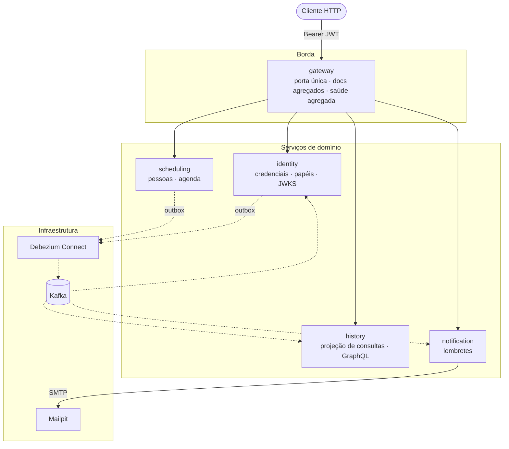
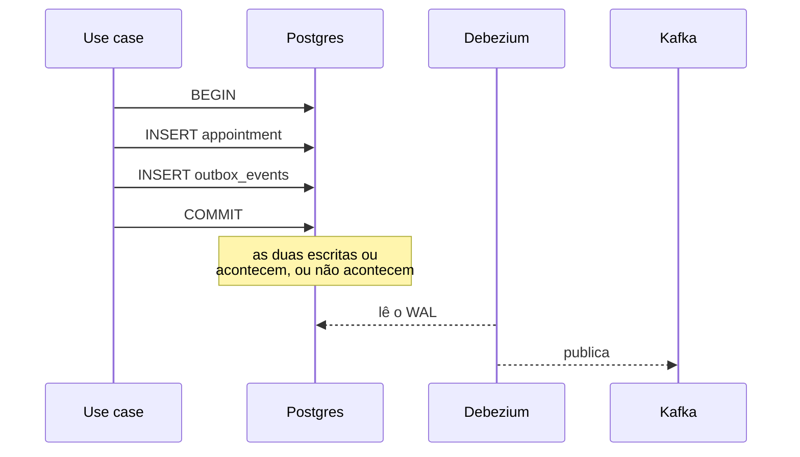
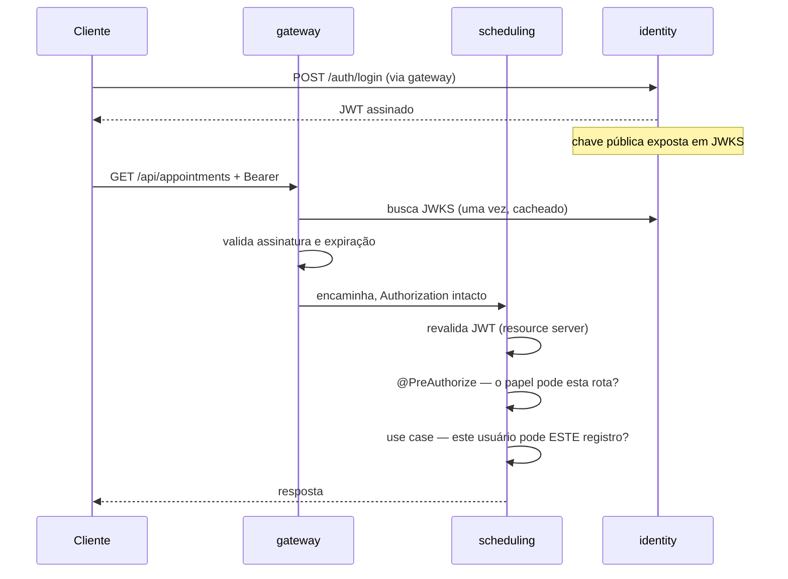
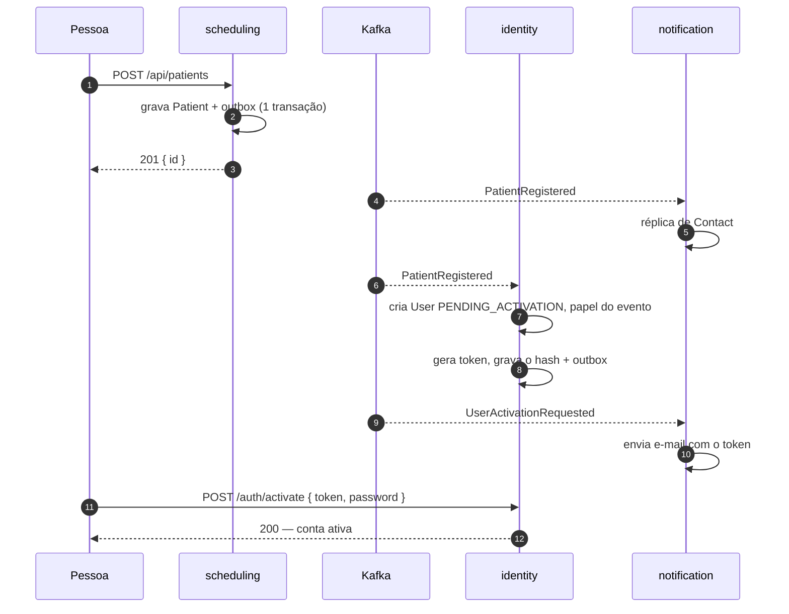
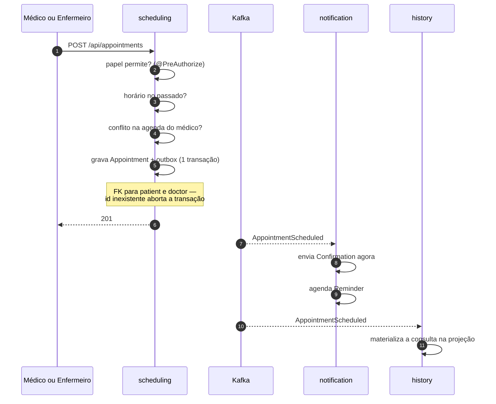
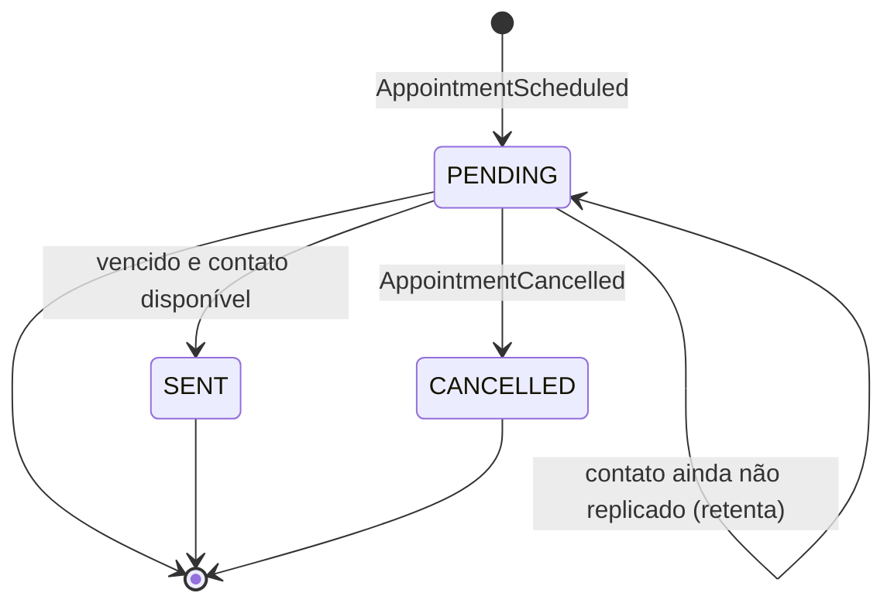
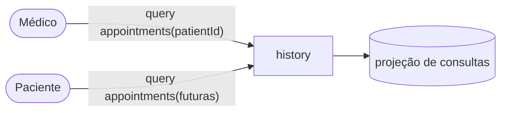

# Desenho do sistema — hospital-management

> **Status:** proposta para revisão por pares. Nada implementado.
> **Objetivo deste documento:** dar contexto suficiente para que alguém que não
> participou das decisões consiga discordar delas com argumento.
> **Não é:** guia de execução, referência de API, nem tutorial. Endpoints ficam
> no Swagger; o raciocínio de cada decisão isolada fica nos ADRs em `docs/adr/`.

---

## Parte I — Por quê

### 1. Problema e restrições

O enunciado da Fase 3 pede um backend hospitalar com agendamento de consultas,
histórico do paciente e lembretes automáticos, acessível a três perfis com
permissões distintas. Ele impõe cinco restrições explícitas:

| # | Restrição | Onde aparece no desenho |
|---|---|---|
| 1 | Autenticação com Spring Security e níveis de acesso por perfil | §6 |
| 2 | GraphQL para consultas flexíveis sobre o histórico | §3, §7.6 |
| 3 | Separação em mais de um serviço | §2 |
| 4 | Comunicação assíncrona via RabbitMQ ou Kafka | §4 |
| 5 | Agendamento publica mensagem; notificações consome e avisa o paciente | §7.4, §7.5 |

Os três serviços que o enunciado nomeia — agendamento, notificações e histórico
— aparecem um a um na árvore de módulos, com o nome que ele usa:

```
services/
├── gateway/        ← adição nossa
├── identity/       ← adição nossa
├── scheduling/     ← "Serviço de Agendamento"
├── history/        ← "Serviço de histórico"
└── notification/   ← "Serviço de notificações"
```

#### Onde cada capacidade exigida vive

A tabela abaixo é o mapa que quem avalia deve conseguir seguir sem ler o resto do
documento. Cada linha tem uma requisição correspondente na collection do Postman,
nomeada pelo requisito.

| Capacidade no enunciado | Onde vive |
|---|---|
| Médico visualiza o histórico de consultas | `history` — query GraphQL |
| Médico **edita** o histórico de consultas | `scheduling` — remarcar, cancelar e concluir consulta. O enunciado atribui "criação e edição das consultas" ao serviço de agendamento; é o mesmo ato |
| Enfermeiro registra consultas | `scheduling` — criar consulta |
| Enfermeiro acessa o histórico | `history` — query GraphQL |
| Paciente visualiza apenas as suas consultas | `history` — query GraphQL, escopo aplicado no resolver |
| Consultas flexíveis: todos os atendimentos ou só os futuros | `history` — argumento da query |
| Agendamento publica ao criar ou editar consulta | `scheduling` — outbox, 4 eventos de consulta |
| Notificações consome e avisa o paciente | `notification` — Confirmation e Reminder |

#### O que o enunciado deixa ambíguo

**"Autenticação básica."** Pode significar HTTP Basic literal, ou apenas
"autenticação simples". Atendemos as duas leituras sem escolher entre elas: a
credencial entra por `Authorization: Basic` no `POST /auth/login`, processada
pelo Spring Security, e o que sai é um JWT que os cinco serviços validam offline
(ADR-0013). HTTP Basic em toda request obrigaria cada serviço a verificar
credencial o tempo todo — chamando o Identity no caminho quente, ou
compartilhando a tabela de usuário.

**"Consultas flexíveis... ou apenas as futuras."** A distinção futuro/passado
sai do relógio: o histórico compara `scheduledAt` com o instante da consulta
GraphQL. Não há fluxo de "abrir" ou "reabrir" consulta.

**Quem cadastra as pessoas.** O enunciado descreve três perfis e o que cada um
faz com consultas, mas nunca descreve o cadastro. Resolvemos com auto-cadastro
público de paciente e cadastro de profissionais por rota autenticada (§7.1).

#### O que decidimos por conta própria, e deve ser lido como escolha nossa

O **gateway** (ADR-0011, ADR-0014), o **serviço de identidade** (ADR-0006), o
**JWT com JWKS** para propagar a autenticação entre serviços (ADR-0013), o
**outbox transacional com Debezium** no lugar de publicação direta (ADR-0012),
**um Postgres por serviço** (ADR-0008), o **auto-cadastro de paciente** e a
**ativação de conta por e-mail**. Nada disso é pedido pelo enunciado, e nada
disso o contraria.

O que deliberadamente **não** fizemos: o paciente não marca a própria consulta. O
enunciado enumera capacidades por perfil e a do paciente tem um verbo só —
visualizar. Criar consulta exigiria ainda modelo de disponibilidade do médico,
endpoint de horários livres e garantia contra concorrência, no requisito que a
avaliação testa de forma mais direta.

### 2. Visão geral

Cinco serviços. Um único ponto de entrada. Toda comunicação entre serviços é
assíncrona; nenhum serviço chama outro por HTTP.



A ideia central em um parágrafo: **cada dado tem exatamente um dono, e a fronteira
entre donos coincide com o domínio, não com a infraestrutura.** Quem precisa de
dado alheio mantém réplica alimentada por evento, para que nenhum serviço
precise perguntar nada a outro em tempo de request.

A consequência menos óbvia dessa regra é onde as pessoas moram. `Patient` e
`Doctor` são domínio nuclear — têm CPF, CRM, especialidade, e são participantes
do agregado de consulta. `User`, `Role` e credencial são subdomínio genérico:
seriam idênticos num e-commerce. Por isso o `scheduling` é dono das pessoas e o
`identity` é dono apenas do acesso delas, provisionado a partir dos eventos de
cadastro (ADR-0015). A mesma pessoa existe nos dois contextos, em aspectos
diferentes, ligada pelo mesmo identificador.

### 3. Fronteiras de contexto

Três contextos de domínio e uma projeção. O gateway não é um contexto: não tem
linguagem própria, não tem estado, não tem regra de negócio.

| Contexto | É dono de | Mantém réplica de | Expõe |
|---|---|---|---|
| **identity** | User, Role, credencial, token de ativação | — | REST (login, ativação, JWKS) |
| **scheduling** | Patient, Doctor, Appointment | — | REST |
| **history** | — | Appointment (read-only) | GraphQL |
| **notification** | Notification, Reminder, Confirmation | Contact (read-only) | REST (consulta) |

O glossário de cada contexto vive em `services/<contexto>/CONTEXT.md`, e o mapa
de relações em `CONTEXT-MAP.md`.

O `User` do identity **não é réplica**: ele nasce de um evento, mas o identity é
dono dele — senha, estado da conta, troca de papel e último acesso são escritos
por casos de uso próprios, nunca por consumidor.

O `history` é o oposto: não é dono de nada. É um **read model** puro, que
materializa consultas a partir de evento e as expõe por GraphQL, exatamente como
o enunciado o descreve. Não recebe escrita de ninguém.

#### Por que essa divisão e não outra

A divisão segue a pergunta *"quem tem autoridade para mudar este dado?"*, não
*"quem lê este dado?"*. Quem corrige o nome de um paciente, o CRM de um médico ou
o e-mail de contato é o balcão do hospital; quem troca uma senha é o serviço de
autenticação, e ninguém mais. O `history` lê consultas o tempo todo e não tem
autoridade nenhuma sobre elas — por isso projeta em vez de possuir.

A consequência mais visível: **o `history` responde por dado que não possui.** Se
a projeção atrasar, o histórico não falha — mostra menos consultas do que
existem. É comportamento esperado, não defeito (§9, R6).

#### O layout do banco do scheduling

O `scheduling` é dono de três agregados e separa participantes de agenda em dois
schemas do mesmo banco. Schemas diferentes dentro de um mesmo banco compartilham
conexão e transação, então a chave estrangeira e o `BEGIN … COMMIT` continuam
valendo — a separação é organizacional, não física.

```sql
CREATE SCHEMA participants;
CREATE SCHEMA scheduling;

CREATE TABLE participants.patient (
    id              UUID PRIMARY KEY,
    tax_identifier  VARCHAR(14)  NOT NULL UNIQUE,
    name            VARCHAR(150) NOT NULL,
    email           VARCHAR(150) NOT NULL,
    phone           VARCHAR(20),
    active          BOOLEAN      NOT NULL DEFAULT true,
    created_at      TIMESTAMPTZ  NOT NULL DEFAULT now()
);

CREATE TABLE participants.doctor (
    id              UUID PRIMARY KEY,
    tax_identifier  VARCHAR(14)  NOT NULL UNIQUE,
    crm             VARCHAR(20)  NOT NULL UNIQUE,
    specialty       VARCHAR(80)  NOT NULL,
    name            VARCHAR(150) NOT NULL,
    email           VARCHAR(150) NOT NULL,
    active          BOOLEAN      NOT NULL DEFAULT true,
    created_at      TIMESTAMPTZ  NOT NULL DEFAULT now()
);

CREATE TABLE scheduling.appointment (
    id            UUID PRIMARY KEY,
    patient_id    UUID NOT NULL REFERENCES participants.patient(id),
    doctor_id     UUID NOT NULL REFERENCES participants.doctor(id),
    scheduled_at  TIMESTAMPTZ NOT NULL,
    status        VARCHAR(20) NOT NULL,
    fit_in        BOOLEAN     NOT NULL DEFAULT false,
    fit_in_reason VARCHAR(255),
    cancelled_at  TIMESTAMPTZ,
    created_at    TIMESTAMPTZ NOT NULL DEFAULT now()
);
```

`public` fica com o que é infraestrutura e não pertence a nenhum dos dois lados:
`outbox_events` e o histórico do Flyway.

Não existe entidade `Contact`: e-mail e telefone são atributos da pessoa. Uma
tabela à parte numa relação 1:1 com duas colunas não paga o próprio custo, e
deixaria o e-mail do médico sem lugar simétrico.

### 4. Os dois planos de comunicação

O sistema tem dois planos com regras opostas, e confundi-los é o erro mais fácil
de cometer ao evoluir este código.


**Norte-sul é sempre síncrono.** Comandos e consultas entram por HTTP, atravessam
o gateway e chegam ao serviço. O gateway também faz chamadas síncronas de leitura
aos serviços para agregar documentação e saúde (§6, ADR-0014) — isso é
norte-sul, não cria dependência entre serviços.

**Leste-oeste é sempre assíncrono.** *Nenhum serviço chama outro serviço por
HTTP.* Na maioria esmagadora dos casos, uma chamada dessas é sintoma de que a
divisão de propriedade do §3 furou — e o remédio é rever a fronteira, não abrir
exceção.

A regra tem uma condição de quebra legítima, e vale declará-la para que ninguém
precise contorná-la às escondidas: **um fluxo que exija resposta autoritativa e
imediata de outro contexto**, em que o solicitante não possa prosseguir sem
saber. Coreografia não resolve esse caso — produz estado intermediário sem dono.
Nenhum fluxo deste sistema cai nessa categoria; se um dia cair, a chamada
síncrona é a resposta certa e o §3 é que precisa ganhar a exceção por escrito.

#### Como os eventos evoluem

Os eventos são a única superfície de integração — não há HTTP entre serviços que
sirva de alternativa. Todo evento carrega envelope com `eventId`, `eventType`,
`eventVersion` e `occurredAt`; mudança aditiva mantém a versão e o consumidor
ignora campo desconhecido; mudança incompatível cria **tipo novo** publicado em
paralelo, e o antigo só sai quando ninguém mais o consome (ADR-0017).

#### O catálogo de eventos

| Evento | Produtor | Consumido por | Para quê |
|---|---|---|---|
| `PatientRegistered` | scheduling | identity, notification | provisionar conta; réplica de contato |
| `PatientContactUpdated` | scheduling | notification | manter o endereço de entrega em dia |
| `DoctorRegistered` | scheduling | identity | provisionar conta |
| `UserActivationRequested` | identity | notification | enviar o e-mail com o token de ativação |
| `AppointmentScheduled` | scheduling | history, notification | materializar consulta; confirmar e programar lembrete |
| `AppointmentRescheduled` | scheduling | history, notification | atualizar projeção; trocar o lembrete pendente |
| `AppointmentCancelled` | scheduling | history, notification | atualizar projeção; cancelar o lembrete |
| `AppointmentCompleted` | scheduling | history | registrar que a consulta ocorreu |

Os eventos de consulta são explícitos quanto à intenção em vez de um único evento
com o estado completo. O motivo está no ADR-0005: com a intenção no tipo, o
consumidor sabe cancelar o lembrete pendente ao remarcar, sem precisar inferir
isso comparando o estado novo com o anterior.

#### Como os dois planos falham

Esta é a propriedade que justifica toda a complexidade assíncrona:

| Falha | Plano síncrono | Plano assíncrono |
|---|---|---|
| Um serviço cai | 502/504 apenas na rota dele | **nada se perde** — outbox retém no Postgres do produtor, Kafka retém a mensagem, o consumidor retoma do offset |
| Kafka cai | não afetado | eventos acumulam no outbox e são publicados quando o Debezium volta |
| Gateway cai | **API inteira inalcançável** | não afetado |
| Debezium cai | **agendamento continua correto** — a validação de participante é chave estrangeira, não réplica | ativação de conta, lembrete e histórico param até voltar |

A última linha é a propriedade prática mais importante do desenho: o caminho de
agendar uma consulta não depende do CDC estar vivo.

### 5. Confiabilidade

#### O problema da escrita dupla, e o outbox

Gravar no banco e depois publicar no Kafka são duas escritas sem atomicidade
entre si. Se a publicação falha após o commit, a consulta existe e nenhum
consumidor jamais fica sabendo. A falha é silenciosa e permanente: não há erro
para o usuário, não há mensagem na fila, e o histórico simplesmente nunca
recebe aquela consulta.

O padrão outbox elimina a janela: o evento é gravado numa tabela `outbox_events`
**dentro da mesma transação** do dado de negócio. Se a transação commita, o
evento existe; se aborta, não existe nenhum dos dois. Um conector Debezium lê o
WAL do Postgres e publica no Kafka (ADR-0012).



A escrita no outbox usa `@Transactional(propagation = MANDATORY)`, que falha alto
se alguém chamar o writer fora de uma transação existente — o erro aparece no
desenvolvimento, não em produção.

#### Quais bancos têm outbox — e por que não todos

Outbox é propriedade de **produtor de evento**, não de banco. Dos quatro bancos,
apenas dois publicam:

| Banco | Publica | Tem `outbox_events` | `wal_level=logical` | Conector |
|---|---|---|---|---|
| `scheduling` | cadastro de pessoas e os 4 eventos de consulta | sim | sim | 1 |
| `identity` | `UserActivationRequested` | sim | sim | 1 |
| `history` | nada — apenas consome | não | não | — |
| `notification` | nada — apenas consome | não | não | — |

São, portanto, **dois conectores** a registrar e **dois** Postgres com replicação
lógica ligada; os outros dois sobem como Postgres comum.

Não criamos a estrutura nos quatro por antecipação, e a razão é operacional: um
*replication slot* sem conector consumindo faz o Postgres **parar de reciclar
WAL**, à espera de um consumidor que nunca chega. O disco enche em silêncio, sem
erro visível, até acabar o espaço. É o modo de falha clássico de CDC e não vale
pagá-lo por um evento hipotético.

#### Integridade referencial dentro do scheduling

Como `Patient`, `Doctor` e `Appointment` vivem no mesmo banco, a existência dos
participantes é garantida por chave estrangeira, dentro da mesma transação que
grava a consulta. Não há réplica de identificadores a consultar, não há janela
entre cadastrar e agendar, e não há política a inventar para o caso "a cópia
ainda não chegou".

#### Falha no consumo

Kafka não tem dead-letter nativa. O tratamento é explícito:

- Retentativa com espera fixa; esgotada, a mensagem vai para o tópico `.DLT`
- Erro não-recuperável — payload inválido, violação de validação — vai direto
  para a DLT sem gastar retentativas
- `ErrorHandlingDeserializer` é **obrigatório**: sem ele, uma mensagem malformada
  nunca desserializa, o offset nunca avança e o consumidor entra em laço infinito
  consumindo a mesma mensagem para sempre

#### Entrega ao menos uma vez, e o que isso obriga (ADR-0016)

Kafka entrega **ao menos uma vez**. Reprocessamento não é exceção: acontece em
rebalanceamento de partição, em falha depois do efeito e antes do commit do
offset, e sempre que o consumidor é reiniciado com offset atrasado. Sem
tratamento, o mesmo evento manda dois e-mails, cria dois lembretes e duplica
linhas na projeção.

Todo evento carrega um `eventId` gerado na escrita do outbox, e todo consumidor
descarta o que já processou:

```sql
CREATE TABLE processed_event (
    event_id    UUID PRIMARY KEY,
    consumer    VARCHAR(50)  NOT NULL,
    received_at TIMESTAMPTZ  NOT NULL DEFAULT now()
);
```

A inserção nessa tabela e o efeito acontecem na **mesma transação local** do
consumidor: se o efeito falha, o registro de processamento não fica para trás; se
o evento chega de novo, a chave primária o rejeita antes de qualquer efeito.

Onde o efeito é naturalmente idempotente, a tabela é reforço e não a única
defesa: a projeção do `history` grava por `upsert` na chave da consulta, e a
réplica de contato do `notification` grava por `upsert` no identificador do
paciente. O caso que **não** é idempotente por natureza é o envio de e-mail, e é
ali que o descarte por `eventId` faz o trabalho real.

#### Réplicas e a janela de inconsistência

As duas réplicas — a de contato no notification e a projeção de consultas no
history — são eventualmente consistentes, e isso é visível ao usuário. Uma
consulta recém-criada pode não aparecer imediatamente na resposta GraphQL. Um
paciente cadastrado e agendado no mesmo segundo pode ter lembrete programado
antes de sua réplica de contato existir; nesse caso o lembrete permanece pendente
e é retentado na varredura seguinte, com teto de tentativas.

A ativação de conta atravessa a mesma janela, e é o único lugar do sistema onde
ela é confortável: entre o cadastro e o clique no link do e-mail há segundos ou
minutos de leitura humana, ordens de grandeza acima da latência do CDC.

#### Incompletude visível, em vez de silenciosa

Uma projeção atrasada e uma projeção vazia produzem a mesma resposta: menos
consultas. Quem lê o histórico não distingue "este paciente não tem consultas" de
"o consumidor está parado há duas horas" — e a segunda leitura, tomada pela
primeira, é como uma falha de infraestrutura vira decisão errada de quem usa.

A projeção guarda o instante do último evento aplicado, e a resposta GraphQL o
expõe junto dos dados. Quem consulta passa a ter como perceber que está olhando
uma foto velha, e o `GET /health/system` do gateway usa o mesmo carimbo para
mostrar atraso de projeção sem depender de inspecionar o Kafka.

Isso não impede a incompletude — ela é inerente à leitura eventualmente
consistente. Impede que ela seja **invisível**, que é o que a torna perigosa.

### 6. Segurança



**Autenticação** (ADR-0013): a credencial chega ao `POST /auth/login` no cabeçalho
`Authorization: Basic`, processada pelo Spring Security — autenticação básica na
porta de entrada, como o enunciado pede de forma literal. O Identity a valida e
devolve um JWT assinado com par de chaves, publicando a chave pública em JWKS.
Gateway e serviços validam a assinatura offline — nenhuma chamada ao Identity no
caminho da request. Segredo HMAC compartilhado foi recusado porque permitiria que
qualquer um dos cinco serviços forjasse um token.

O identificador de login é o **CPF**, não o e-mail. O e-mail é dado de contato e
pode ser corrigido no `scheduling` a qualquer momento — correção que o
`PatientContactUpdated` propaga ao `notification`. Se o e-mail fosse o handle de
login, cada correção exigiria sincronizar também o `identity`. O CPF não muda.

**O que é verificado em cada token**, além de assinatura e expiração: o emissor
(`iss`), o destinatário (`aud`) e o algoritmo permitido — aceitar o `alg` que o
próprio token declara é o caminho clássico para falsificação. O tempo de vida é
curto, e a rotação de chave é transparente porque cada token traz o `kid` que
identifica a chave usada.

Um token permanece válido até expirar, mesmo que a conta seja desativada no
intervalo. Isso é consequência aceita da validação offline: a alternativa seria
consultar o Identity a cada request, exatamente o acoplamento que o desenho
evita. O tempo de vida curto é o que limita a janela.

**Rotas públicas.** São quatro, e a lista precisa estar explícita na configuração
do gateway e de cada serviço — rota aberta por descuido não produz erro visível:

| Rota | Serviço | Por quê |
|---|---|---|
| `POST /auth/login` | identity | autenticar |
| `GET /.well-known/jwks.json` | identity | chave pública para validação offline |
| `POST /auth/activate` | identity | definir senha na ativação |
| `POST /api/patients` | scheduling | auto-cadastro de paciente |

Nenhuma rota pública cria credencial diretamente, e **o papel nunca vem do
cliente**: ele é decidido pelo `scheduling`, que é dono das pessoas, e chega ao
identity dentro do evento de cadastro. Um corpo de requisição não consegue
pleitear `DOCTOR`.

**Autorização em dois níveis** (ADR-0007), e o segundo nível é o que importa:

- O `@PreAuthorize` no controller barra por papel: *este perfil pode chamar esta
  rota?*
- O **use case** aplica o escopo do dado: *este usuário pode tocar neste
  registro?*

A regra do enunciado *"pacientes visualizam apenas as suas consultas"* é
impossível de aplicar na borda — o gateway conhece o papel, não conhece o dono de
cada linha. Colocar autorização apenas no controller é precisamente o erro que
esta separação existe para evitar: um endpoint protegido por papel correto ainda
entrega dado de terceiro.

O escopo é uma comparação direta: `User.id` e `Patient.id` são a mesma chave por
construção, então o `sub` do token é a chave do paciente na tabela local, sem
tradução intermediária.

| Perfil | scheduling (REST) | history (GraphQL) |
|---|---|---|
| Médico | criar, modificar e concluir consultas | consultar |
| Enfermeiro | criar, modificar e concluir consultas | consultar |
| Paciente | — | consultar **apenas as suas** |

O papel do gateway está em ADR-0014: ele é a porta única de entrada, o agregador
de documentação e o agregador de saúde. Ele **não** é a única barreira de
autenticação — os serviços revalidam por conta própria, e removê-lo não abriria
o sistema.

---

## Parte II — Como se comporta

### 7. Fluxos principais

#### 7.1 Cadastro e ativação de conta

O `scheduling` registra a pessoa; o `identity` provisiona a conta a partir do
evento, sem senha; o paciente define a própria credencial pelo link que recebe.
Nenhuma senha atravessa o domínio, e nenhum segredo trafega por tópico.



O cadastro de médico segue o mesmo caminho por `POST /api/doctors`, rota
autenticada, e emite `DoctorRegistered`.

**O enfermeiro não tem cadastro de participante.** Ele não participa de consulta
— não é para ele que uma consulta é marcada —, então não existe tabela dele no
`scheduling`. Ele existe apenas como conta no `identity`, criada por rota
autenticada que só aceita o papel de enfermeiro.

O token de ativação é de uso único, tem prazo de validade e pode ser reemitido.
O `identity` guarda apenas o hash.

#### 7.2 Contas iniciais, e por que elas existem (ADR-0016)

Duas coisas seriam impossíveis sem semente. A primeira é circular: `POST
/api/doctors` exige autenticação de um profissional, e não há profissional antes
do primeiro. A segunda é de avaliação: se o único caminho para a primeira
credencial atravessa Postgres, Debezium, Kafka, Identity, Kafka de novo,
Notification e a caixa de e-mail, então **uma falha em qualquer elo impede o
login e derruba a validação inteira** antes de ela começar.

A migração inicial de cada banco cria três contas de demonstração — um médico,
um enfermeiro e um paciente — já ativas, com CPF e senha fixos e documentados no
README. O identificador é o mesmo nos dois bancos, porque `User.id` e
`Patient.id` são a mesma chave.

O login funciona no primeiro segundo depois do `docker compose up`, sem depender
de nenhum evento. O fluxo de ativação continua sendo demonstrável, numa pasta
própria da collection, mas deixa de estar no caminho crítico de tudo o mais.

#### 7.3 Cadastro pelo balcão

Quando o enfermeiro cadastra o paciente, o fluxo é o mesmo do §7.1 — muda apenas
quem dispara a primeira requisição. O paciente continua sendo quem define a
própria senha, pelo e-mail.

#### 7.4 Agendamento de consulta



As invariantes do agendamento estão no ADR-0010 e se resumem a quatro regras:

```
CRIAR
  ├── não agendar no passado                          → 400
  ├── conflito de agenda do médico                    → 409
  │     └── exceto se encaixe = true, com justificativa
  └── sem antecedência mínima

REMARCAR / CANCELAR
  ├── consulta já iniciada ou passada                 → 409
  ├── consulta concluída                              → 409
  └── dentro de 1h do horário: permitido, registrado

CONCLUIR
  ├── consulta cancelada                              → 409
  └── idempotente

LEMBRETE (notification)
  └── se consulta − offset <= now, não cria Reminder
```

O **encaixe** é a autorização explícita para violar o conflito de agenda — o que
a palavra significa no hospital. Acompanha justificativa, para que o desvio fique
auditável e visível no histórico.

#### 7.5 Disparo do lembrete

O Notification é o único serviço com estado próprio de tempo. Um agendador varre
lembretes vencidos e ainda pendentes.



Na remarcação, o lembrete pendente é cancelado e um novo é criado com a nova
data. Sem isso, o paciente receberia lembrete de um horário que não existe mais —
o cenário que motivou a escolha de eventos explícitos no ADR-0005.

Consulta marcada perto demais do horário não gera lembrete: o consumidor
verifica, ao criar o Reminder, se a data de disparo já passou.

#### 7.6 Leitura do histórico

O `history` materializa cada consulta a partir dos eventos e responde por
GraphQL. Ele não recebe escrita de nenhum perfil.



O filtro futuro/passado compara `scheduledAt` com o instante da consulta, e o
`status` distingue realizada de cancelada. O paciente só enxerga as próprias
consultas: a regra é aplicada no resolver, comparando o `sub` do token com o
`patientId` da projeção.

### 8. Casos de borda

| Situação | Comportamento | Onde está decidido |
|---|---|---|
| Consulta remarcada com lembrete pendente | lembrete antigo cancelado, novo criado | ADR-0005 |
| Consulta cancelada | lembrete cancelado, paciente avisado | ADR-0005 |
| Agendamento para paciente ou médico inexistente | recusado — violação de chave estrangeira na mesma transação | §5 |
| Agendamento em horário já ocupado do médico | recusado com 409, salvo encaixe justificado | ADR-0010 |
| Cancelamento na última hora | permitido, com o instante registrado | ADR-0010 |
| Tentativa de cancelar consulta já passada | recusada com 409 | ADR-0010 |
| Consulta que passou sem ser concluída | permanece `SCHEDULED`; a ausência é derivável pelo horário | ADR-0010 |
| Lembrete vence sem réplica de contato | permanece pendente, retentado com teto | §7.5 |
| Consulta criada perto demais do horário | nenhum lembrete é criado | §7.5 |
| Ativação antes de o evento de cadastro chegar | token ainda desconhecido; nova tentativa resolve | §5 |
| Token de ativação expirado ou já usado | recusado; reemissão disponível | §7.1 |
| Pessoa cadastrada que nunca ativou | existe e é agendável, mas não faz login | §7.1 |
| Debezium fora do ar | cadastro e agendamento normais; ativação, lembrete e histórico param e recuperam ao voltar | §4 |
| Serviço consumidor fora do ar | eventos aguardam no Kafka, consumidos ao voltar | §4 |
| Mensagem malformada no tópico | vai para a DLT após retentativas; não bloqueia o consumidor | §5 |

---

## Parte III — Riscos e próximos passos

### 9. Riscos conhecidos

| # | Risco | Severidade | Mitigação |
|---|---|---|---|
| R1 | **Treze containers.** Quanto mais peças, maior a chance de a stack não subir limpa na máquina de quem avalia | Alta | `healthcheck` em todo banco e `condition: service_healthy` em toda aplicação (ADR-0008); `GET /health/system` para diagnóstico imediato |
| R2 | **Registro dos conectores Debezium é passo posterior ao `docker compose up`.** Se falhar, cadastro e agendamento continuam corretos, mas ativação de conta, lembrete e histórico ficam mudos | Alta | Container de uso único dentro da rede do Compose, idempotente, aguardando o Connect ficar saudável (ADR-0012). As contas de demonstração são semeadas na migração, então **o login não depende do CDC** (§7.2) |
| R3 | **Java 26 não é LTS** e quem avalia provavelmente tem 17 ou 21 | Média | Build multi-stage em Docker com imagem pinada; caminho Docker documentado como oficial (ADR-0009) |
| R4 | **Pirâmide de testes completa em cinco serviços** é o maior custo de esforço do projeto, num fator que a rubrica não nomeia | Média | Priorizar os testes de escopo de autorização e do caminho Kafka, que cobrem o risco real |
| R5 | **A ativação de conta atravessa sete peças** — banco, Debezium, Kafka, Identity, Kafka, Notification e caixa de e-mail | Média | Contas de demonstração semeadas e já ativas (§7.2) tiram a ativação do caminho crítico; ela vira pasta própria da collection, que extrai o token pela API do Mailpit |
| R6 | **Consistência eventual visível ao usuário**: consulta recém-criada pode não aparecer imediatamente no histórico | Baixa | Documentar como comportamento esperado, não como defeito |
| R7 | **Gateway é ponto único de entrada**: fora do ar, a API inteira fica inalcançável mesmo com todos os serviços saudáveis | Baixa | `GET /health/system` distingue "gateway caiu" de "serviço caiu" (ADR-0014) |
| R8 | **Rota pública de escrita sem limitação de taxa** — o auto-cadastro aceita volume arbitrário | Baixa | Fora do escopo desta entrega; registrado nos próximos passos (§11) |

### 10. Decisões tomadas contra a recomendação

Registradas aqui porque um revisor deve poder atacá-las sabendo que já foram
questionadas uma vez.

| Decisão | Recomendação original | Motivo declarado |
|---|---|---|
| **Pessoas no domínio**, e não no serviço de identidade | o serviço de identidade é dono dos usuários | `Patient` e `Doctor` são domínio nuclear; autenticação é subdomínio genérico. Um servidor de autenticação dono de CRM e prontuário é a fronteira no lugar errado |
| **Kafka** em vez de RabbitMQ | RabbitMQ — mais leve para fan-out, fila e DLQ por consumidor, UI nativa | Replay de eventos e fluência operacional prévia do time |
| **Quatro Postgres** em vez de um com quatro databases | Um container, quatro databases lógicos | Isolamento físico torna a fronteira de propriedade impossível de furar |
| **Java 26** em vez de Java 25 LTS | Java 25 LTS | Já é o JDK padrão da máquina e há referência própria rodando 26 com Boot 4.1 |
| **Debezium** em vez de poller na aplicação | Ambos aceitáveis; poller dispensa container | Fidelidade ao padrão de referência já validado |
| **Fluxo de ativação por e-mail** em vez de credencial criada junto com o cadastro | uma chamada a mais e um segundo conector Debezium | Nenhuma rota pública cria credencial e o papel nunca vem do cliente; a alternativa de fazer o token viajar no evento foi recusada porque o `notification` precisa dele em claro, e o kafbat-ui expõe o tópico sem autenticação |

### 11. Próximos passos, fora do escopo desta entrega

- **Trava temporal na conclusão de consulta.** Hoje é possível marcar como
  realizada uma consulta futura. A trava não entrou porque, sem ambiente de
  produção, ela impediria o próprio avaliador de exercitar o fluxo — mas é o
  primeiro item a acrescentar num uso real.
- **Limitação de taxa no auto-cadastro**, contra cadastro em massa e enumeração
  de CPF.
- **Disponibilidade do médico** — janelas de atendimento e horários livres, sem
  as quais o paciente não pode marcar a própria consulta.
- **Identidade única de pessoa.** O `UNIQUE` de CPF é por tabela: alguém que seja
  médico e paciente teria dois cadastros e duas contas.

---

## Apêndices

### A. Stack e versões

**Verificado** — confirmado no Maven Central, no registro de imagens, ou em
projeto próprio já em execução:

| Componente | Versão | Como foi verificado |
|---|---|---|
| Java | 26.0.1 | instalado localmente |
| Spring Boot | 4.1.0 | `maven-metadata.xml` do Maven Central |
| Maven | 3.9.16 | instalado localmente |
| Imagem de build | `maven:3.9-eclipse-temurin-26` | em uso no `Dockerfile` |
| Imagem de runtime | `eclipse-temurin:26-jre` | em uso no `Dockerfile` |
| PostgreSQL | `18-alpine` | de pé no `docker-compose.yml`; o banco respondeu `PostgreSQL 18.6` |
| Apache Kafka | `4.1.0` (KRaft) | de pé no `docker-compose.yml`, cluster online no kafbat-ui |
| kafbat-ui | `v1.5.0` | de pé no `docker-compose.yml` |
| Mailpit | `v1.28` | de pé no `docker-compose.yml`; **API HTTP provada ponta a ponta** |
| `springdoc-openapi` | `3.1.0` (`-starter-webmvc-ui`) | pom pai é o `spring-boot-starter-parent:4.1.0`; agregação de dois serviços num Swagger só, vista no browser |
| `spring-boot-starter-graphql` | 4.1.0 | existe no Maven Central, assim como `-kafka`, `-flyway` e `-oauth2-resource-server` |

⚠ O `PGDATA` do PostgreSQL 18 é `/var/lib/postgresql/18/docker`, e não mais
`/var/lib/postgresql/data`. Volume montado no caminho antigo cria um volume que
nunca recebe dado, e o banco parece funcionar até reiniciar.

⚠ A confirmação do `spring-boot-starter-graphql` é do **nome do artefato**, não
de que a integração funcione sob Boot 4.

**Não verificado** — precisa ser confirmado quando o componente entrar; um
revisor não deve tratar como fato:

| Componente | Observação |
|---|---|
| Debezium Connect | `3.6.1.Final` no `quay.io/debezium/connect:3.6.1.Final`, presente no `docker-compose.yml` deste projeto |
| Testcontainers | versão compatível com Boot 4 não confirmada |

**Nomes de starter no Spring Boot 4** — a reorganização de módulos renomeou
starters de uso diário, e escrevê-los de memória produz erro:

```
spring-boot-starter-webmvc            (não é mais -web)
spring-boot-starter-kafka
spring-boot-starter-flyway   +   flyway-database-postgresql
spring-boot-starter-data-jpa-test
spring-boot-starter-webmvc-test
spring-boot-restclient / spring-boot-http-client
```

E o Jackson passou a viver sob o pacote `tools.jackson` — Jackson 3 —, não mais
`com.fasterxml.jackson`.

**Descartado explicitamente:** Spring Cloud Gateway (ADR-0011), Keycloak
(ADR-0006), stack de observabilidade Prometheus/Grafana/Tempo — três containers
sem contrapartida na avaliação.

### B. Topologia e portas

Treze containers, mais o registrador de conectores, de uso único. Apenas três
portas publicadas no host.

| Publicada | Componente | Uso |
|---|---|---|
| 8080 | gateway | única porta de API, Swagger agregado, GraphiQL, `/health/system` |
| 8090 | kafbat-ui | inspeção de tópicos, mensagens e DLT |
| 8025 | mailpit | caixa de e-mail para conferir ativação e lembrete |

Internos à rede do Compose: as cinco aplicações, os quatro Postgres, o Kafka, o
Debezium Connect e o registrador de conectores.

Os Postgres produtores de evento — scheduling e identity, e **apenas** eles —
sobem com `wal_level=logical`, `max_wal_senders` e `max_replication_slots`
configurados, sem os quais o Debezium não consegue ler o WAL. Os bancos de
history e notification são Postgres comuns, sem outbox e sem conector; o motivo
está em §5.

O banco do scheduling declara os schemas `participants` e `scheduling`, com
`public` reservado a `outbox_events` e ao histórico do Flyway.

### C. Índice de decisões

| ADR | Decisão |
|---|---|
| 0001 | Cinco serviços com gateway e fan-out assíncrono |
| 0002 | Serviço de histórico como projeção read-only |
| 0003 | Monorepo Maven multi-módulo |
| 0004 | Kafka como broker |
| 0005 | Eventos explícitos de consulta |
| 0006 | Identidade em serviço próprio, sem entidades de domínio |
| 0007 | Autorização na borda e no use case |
| 0008 | Um Postgres por serviço |
| 0009 | Java 26 e Spring Boot 4.1.0 |
| 0010 | Invariantes de agendamento |
| 0011 | Gateway próprio em Spring MVC, sem Spring Cloud |
| 0012 | Transactional outbox com Debezium |
| 0013 | Autenticação por JWT com JWKS e ativação de conta |
| 0014 | Papel do gateway: porta única de entrada, documentação e saúde |
| 0015 | Registro de pessoas no domínio |
| 0016 | Idempotência de consumo e contas semeadas |
| 0017 | Versionamento de contratos de evento |
| 0018 | Estrutura interna por feature |
