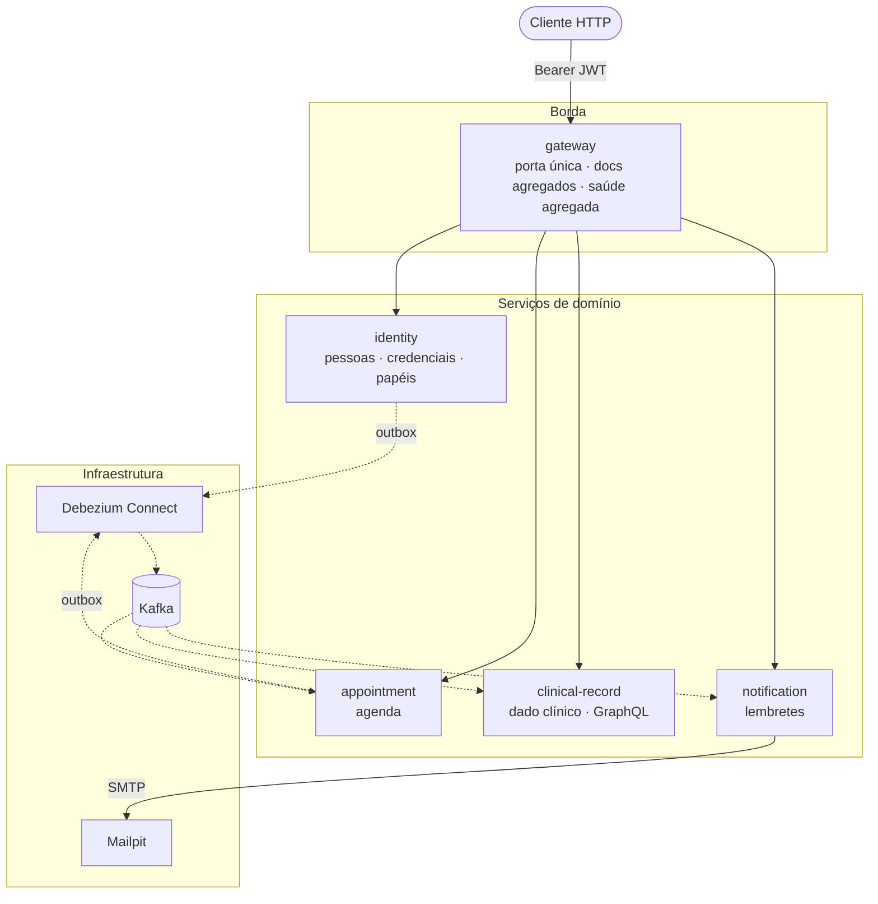
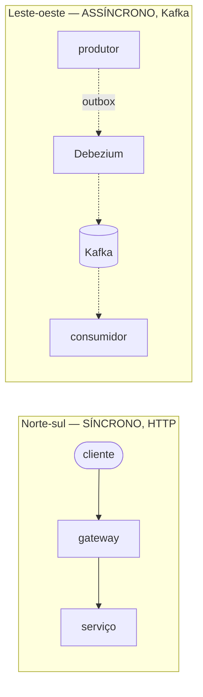
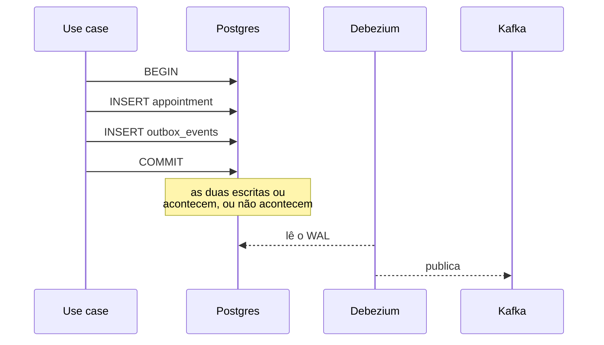
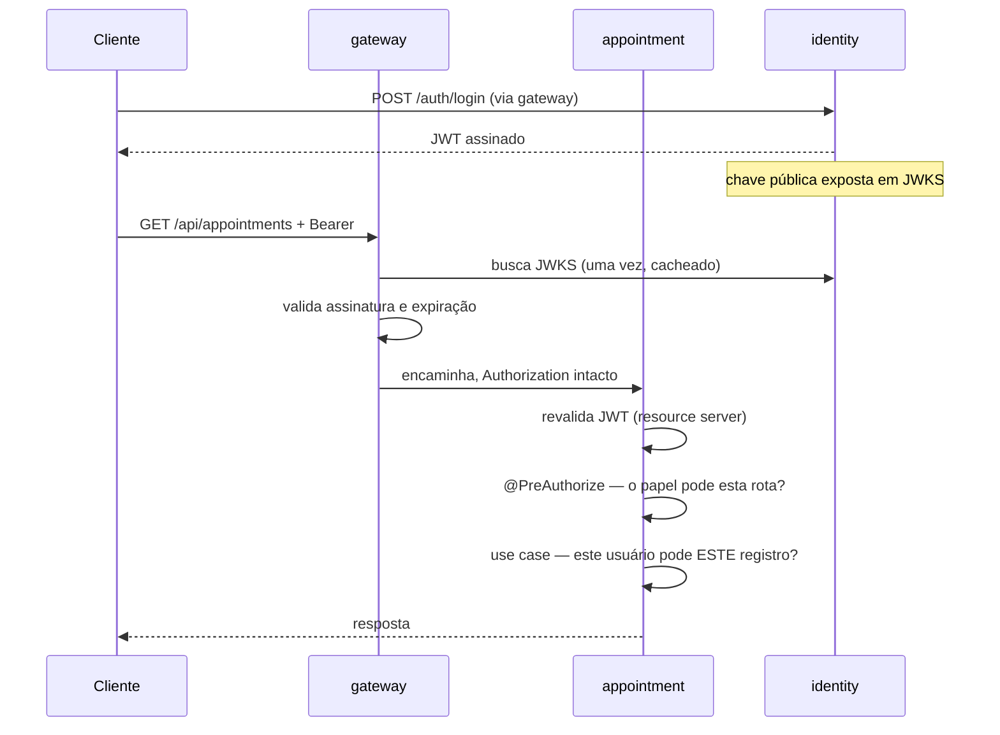
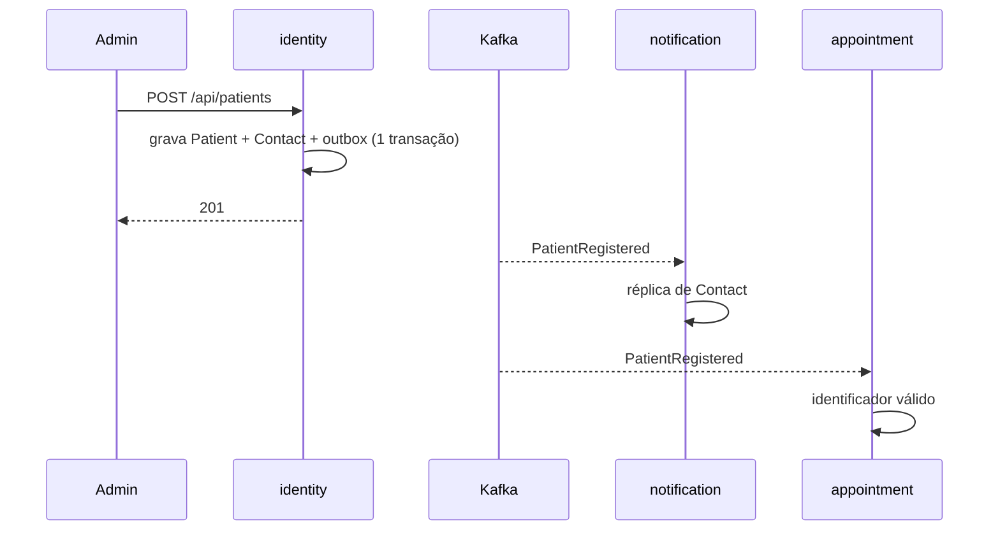
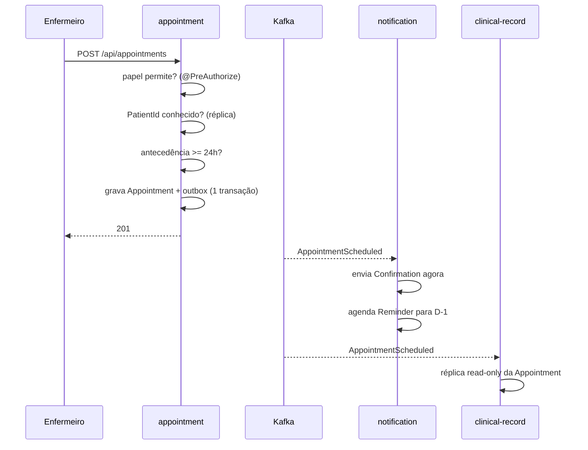
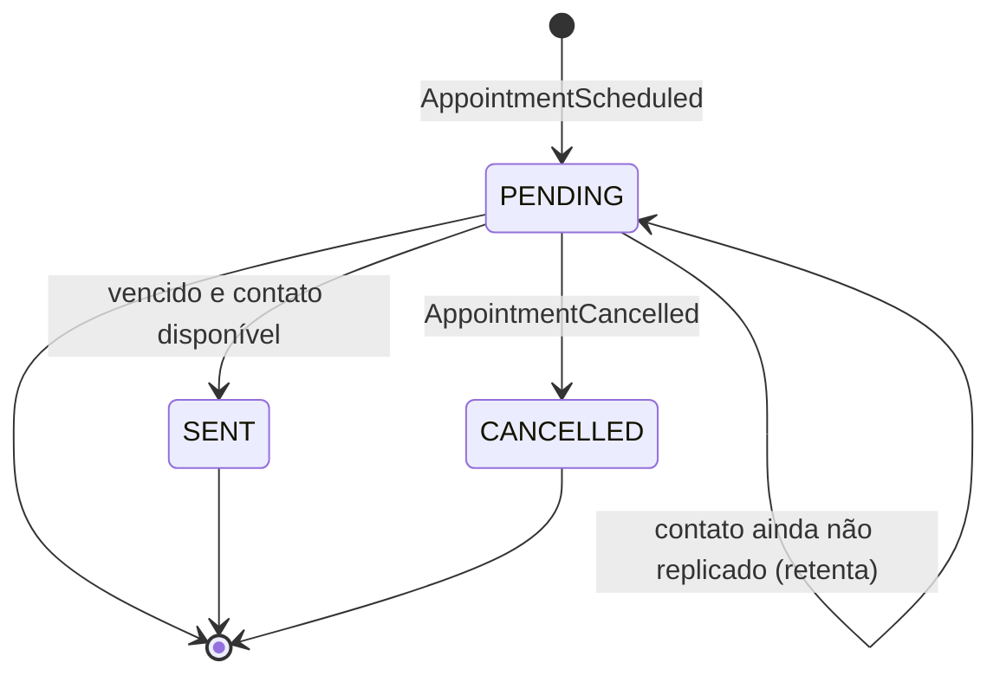
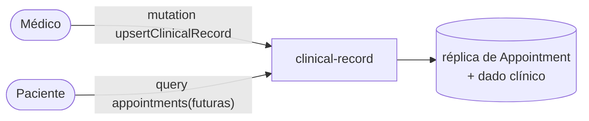

# Desenho do sistema — hospital-management

> **Status:** proposta para revisão por pares. Nada implementado.
> **Objetivo deste documento:** dar contexto suficiente para que alguém que não
> participou das decisões consiga discordar delas com argumento.
> **Não é:** guia de execução, referência de API, nem tutorial. Endpoints ficam
> no Swagger; o raciocínio de cada decisão isolada fica nos ADRs em `docs/adr/`.

---

## Parte I — Por quê

### 1. Problema e restrições

O enunciado da Fase 3 pede um backend hospitalar com agendamento de consultas,
histórico do paciente e lembretes automáticos, acessível a três perfis com
permissões distintas. Ele impõe cinco restrições explícitas:

| # | Restrição | Onde aparece no desenho |
|---|---|---|
| 1 | Autenticação com Spring Security e níveis de acesso por perfil | §6 |
| 2 | GraphQL para consultas flexíveis sobre o histórico | §3, §7.4 |
| 3 | Separação em mais de um serviço | §2 |
| 4 | Comunicação assíncrona via RabbitMQ ou Kafka | §4 |
| 5 | Agendamento publica mensagem; notificações consome e avisa o paciente | §7.2, §7.3 |

#### O que o enunciado deixa ambíguo

Três ambiguidades moldaram o desenho mais do que as restrições:

**"Médicos podem visualizar e editar o histórico."** O mesmo texto descreve o
serviço de histórico como algo que *"armazena e disponibiliza dados via GraphQL"*
— o que sugere projeção read-only — e ao mesmo tempo exige escrita nele. Projeção
pura não tem onde receber escrita. Resolvemos dando ao Clinical Record a
propriedade do dado **clínico**, e não da consulta (ADR-0002).

**"Autenticação básica."** Pode significar HTTP Basic literal, ou apenas
"autenticação simples". Optamos por JWT, com o motivo registrado em ADR-0013 —
HTTP Basic obrigaria cada serviço a verificar credencial a cada request, o que
exige ou chamar o serviço de identidade no caminho quente, ou compartilhar a
tabela de usuário entre cinco serviços.

**"Consultas flexíveis... ou apenas as futuras."** A distinção futuro/passado
precisa existir, mas o enunciado nunca menciona realizar, concluir ou dar falta
em uma consulta. Derivamos a distinção do relógio em vez de inventar um fluxo de
conclusão que ninguém pediu.

#### O que decidimos por conta própria

Duas coisas não vêm do enunciado e devem ser lidas como escolha nossa, não como
requisito: a **antecedência mínima de 24 horas** para agendar (ADR-0010) e o
**serviço de identidade separado** (ADR-0006).

### 2. Visão geral

Cinco serviços. Um único ponto de entrada. Toda comunicação entre serviços é
assíncrona; nenhum serviço chama outro por HTTP.



A ideia central em um parágrafo: **cada dado tem exatamente um dono, e quem
precisa do dado alheio mantém uma réplica alimentada por evento.** Toda a forma
do sistema decorre disso — as réplicas existem para que nenhum serviço precise
perguntar nada a outro em tempo de request.

### 3. Fronteiras de contexto

Quatro contextos de domínio. O gateway não é um contexto: não tem linguagem
própria, não tem estado, não tem regra de negócio.

| Contexto | É dono de | Mantém réplica de | Expõe |
|---|---|---|---|
| **Identity** | User, Role, Patient, Doctor, Contact | — | REST |
| **Appointment** | Appointment | identificadores válidos de Patient | REST |
| **Clinical Record** | Clinical Record (diagnóstico, notas, prescrição) | Appointment (read-only) | GraphQL |
| **Notification** | Notification, Reminder, Confirmation | Contact (read-only) | REST (consulta) |

O glossário de cada contexto vive em `services/<contexto>/CONTEXT.md`, e o mapa
de relações em `CONTEXT-MAP.md`.

#### Por que essa divisão e não outra

A divisão segue a pergunta *"quem tem autoridade para mudar este dado?"*, não
*"quem lê este dado?"*. O Clinical Record lê consultas o tempo todo e não tem
autoridade nenhuma sobre elas — por isso guarda réplica em vez de ser dono. O
Identity é dono do contato do paciente mesmo sendo o Notification quem o usa,
porque quem corrige um e-mail errado é o cadastro, não o disparador de lembrete.

A consequência mais visível dessa regra: **o Appointment não guarda nome, e-mail
nem documento de ninguém.** Ele conhece pessoas por identificador. Uma listagem
de consultas com nome do paciente exige composição no cliente ou uma leitura ao
Identity — deliberadamente, não é o Appointment que resolve isso.

### 4. Os dois planos de comunicação

O sistema tem dois planos com regras opostas, e confundi-los é o erro mais fácil
de cometer ao evoluir este código.



**Norte-sul é sempre síncrono.** Comandos e consultas entram por HTTP, atravessam
o gateway e chegam ao serviço. O gateway também faz chamadas síncronas de leitura
aos serviços para agregar documentação e saúde (§6, ADR-0014) — isso é
norte-sul, não cria dependência entre serviços.

**Leste-oeste é sempre assíncrono.** A invariante é dura: *nenhum serviço chama
outro serviço por HTTP, nunca*. Se um dia aparecer essa chamada, é sinal de que a
divisão de propriedade do §3 furou e o desenho precisa ser revisto, não
contornado.

Os três eventos que trafegam entre serviços são explícitos quanto à intenção —
`AppointmentScheduled`, `AppointmentRescheduled`, `AppointmentCancelled` — em vez
de um único evento com o estado completo. O motivo está no ADR-0005: com a
intenção no tipo, o consumidor sabe cancelar o lembrete pendente ao remarcar, sem
precisar inferir isso comparando o estado novo com o anterior.

#### Como os dois planos falham

Esta é a propriedade que justifica toda a complexidade assíncrona:

| Falha | Plano síncrono | Plano assíncrono |
|---|---|---|
| Um serviço cai | 502/504 apenas na rota dele | **nada se perde** — outbox retém no Postgres do produtor, Kafka retém a mensagem, o consumidor retoma do offset |
| Kafka cai | não afetado | eventos acumulam no outbox e são publicados quando o Debezium volta |
| Gateway cai | **API inteira inalcançável** | não afetado |

### 5. Confiabilidade

#### O problema da escrita dupla, e o outbox

Gravar no banco e depois publicar no Kafka são duas escritas sem atomicidade
entre si. Se a publicação falha após o commit, a consulta existe e nenhum
consumidor jamais fica sabendo. A falha é silenciosa e permanente: não há erro
para o usuário, não há mensagem na fila, e o histórico simplesmente nunca
recebe aquela consulta.

O padrão outbox elimina a janela: o evento é gravado numa tabela `outbox_events`
**dentro da mesma transação** do dado de negócio. Se a transação commita, o
evento existe; se aborta, não existe nenhum dos dois. Um conector Debezium lê o
WAL do Postgres e publica no Kafka (ADR-0012).



A escrita no outbox usa `@Transactional(propagation = MANDATORY)`, que falha alto
se alguém chamar o writer fora de uma transação existente — o erro aparece no
desenvolvimento, não em produção.

#### Quais bancos têm outbox — e por que não todos

Outbox é propriedade de **produtor de evento**, não de banco. Dos quatro bancos,
apenas dois publicam:

| Banco | Publica | Tem `outbox_events` | `wal_level=logical` | Conector |
|---|---|---|---|---|
| `identity` | `PatientRegistered` | sim | sim | 1 |
| `appointment` | `AppointmentScheduled`, `AppointmentRescheduled`, `AppointmentCancelled` | sim | sim | 1 |
| `clinical-record` | nada — apenas consome | não | não | — |
| `notification` | nada — apenas consome | não | não | — |

São, portanto, **dois conectores** a registrar e **dois** Postgres com replicação
lógica ligada; os outros dois sobem como Postgres comum.

Não criamos a estrutura nos quatro por antecipação, e a razão é operacional: um
*replication slot* sem conector consumindo faz o Postgres **parar de reciclar
WAL**, à espera de um consumidor que nunca chega. O disco enche em silêncio, sem
erro visível, até acabar o espaço. É o modo de falha clássico de CDC e não vale
pagá-lo por um evento hipotético.

Se um dia um desses dois contextos precisar publicar — auditoria de alteração de
registro clínico seria o candidato natural — o custo é aditivo e já está mapeado:
tabela de outbox, `wal_level=logical` naquele container, e mais um conector no
script de registro. Nada estrutural muda.

#### Falha no consumo

Kafka não tem dead-letter nativa. O tratamento é explícito:

- Retentativa com espera fixa; esgotada, a mensagem vai para o tópico `.DLT`
- Erro não-recuperável — payload inválido, violação de validação — vai direto
  para a DLT sem gastar retentativas
- `ErrorHandlingDeserializer` é **obrigatório**: sem ele, uma mensagem malformada
  nunca desserializa, o offset nunca avança e o consumidor entra em laço infinito
  consumindo a mesma mensagem para sempre

#### Réplicas e a janela de inconsistência

As réplicas são eventualmente consistentes, e isso é visível ao usuário. Uma
consulta recém-criada pode não aparecer imediatamente na resposta GraphQL do
histórico. Um paciente cadastrado e agendado no mesmo segundo pode ter lembrete
programado antes de sua réplica de contato existir — nesse caso o lembrete
permanece pendente e é retentado na varredura seguinte, com teto de tentativas.

### 6. Segurança



**Autenticação** (ADR-0013): o Identity emite JWT assinado e publica a chave
pública em JWKS. Gateway e serviços validam a assinatura offline — nenhuma
chamada ao Identity no caminho da request. Segredo HMAC compartilhado foi
recusado porque permitiria que qualquer um dos cinco serviços forjasse um token.

**Autorização em dois níveis** (ADR-0007), e o segundo nível é o que importa:

- O `@PreAuthorize` no controller barra por papel: *este perfil pode chamar esta
  rota?*
- O **use case** aplica o escopo do dado: *este usuário pode tocar neste
  registro?*

A regra do enunciado *"pacientes visualizam apenas as suas consultas"* é
impossível de aplicar na borda — o gateway conhece o papel, não conhece o dono de
cada linha. Colocar autorização apenas no controller é precisamente o erro que
esta separação existe para evitar: um endpoint protegido por papel correto ainda
entrega dado de terceiro.

O papel do gateway está em ADR-0014: ele é a porta única de entrada, o agregador
de documentação e o agregador de saúde. Ele **não** é a única barreira de
autenticação — os serviços revalidam por conta própria, e removê-lo não abriria
o sistema.

---

## Parte II — Como se comporta

### 7. Fluxos principais

#### 7.1 Cadastro de paciente

O Identity cria User, Patient e Contact numa transação, gravando o evento de
cadastro no outbox junto. Dois consumidores reagem: o Notification materializa a
réplica de Contact, o Appointment materializa o identificador na lista de
pacientes válidos.



#### 7.2 Agendamento de consulta



#### 7.3 Disparo do lembrete

O Notification é o único serviço com estado próprio de tempo. Um agendador varre
lembretes vencidos e ainda pendentes.



Na remarcação, o lembrete pendente é cancelado e um novo é criado com a nova
data. Sem isso, o paciente receberia lembrete de um horário que não existe mais —
o cenário que motivou a escolha de três eventos explícitos no ADR-0005.

#### 7.4 Registro clínico e leitura do histórico

O médico escreve o dado clínico no Clinical Record, que é dono dele. A leitura do
histórico sai por GraphQL do mesmo serviço, que responde tanto por consultas
passadas quanto futuras — a réplica contém todas.



### 8. Casos de borda

| Situação | Comportamento | Onde está decidido |
|---|---|---|
| Consulta remarcada com lembrete pendente | lembrete antigo cancelado, novo criado | ADR-0005 |
| Consulta cancelada | lembrete cancelado, paciente avisado | ADR-0005 |
| Agendamento com menos de 24h | **recusado com 400** | ADR-0010 |
| Lembrete vence sem réplica de contato | permanece pendente, retentado com teto | ADR-0006 |
| Agendamento para paciente inexistente | recusado — Appointment consulta a réplica de identificadores | ADR-0006 |
| Consulta já passou | continua visível no histórico; nada muda de estado | ADR sobre ciclo de vida derivado (§1) |
| Serviço consumidor fora do ar | eventos aguardam no Kafka, consumidos ao voltar | §4 |
| Mensagem malformada no tópico | vai para a DLT após retentativas; não bloqueia o consumidor | §5 |

---

## Parte III — Riscos e perguntas

### 9. Riscos conhecidos

| # | Risco | Severidade | Mitigação |
|---|---|---|---|
| R1 | **Treze containers.** Quanto mais peças, maior a chance de a stack não subir limpa na máquina de quem avalia | Alta | `healthcheck` em todo banco e `condition: service_healthy` em toda aplicação (ADR-0008); `GET /health/system` para diagnóstico imediato |
| R2 | **Registro do conector Debezium é passo posterior ao `docker compose up`.** Se falhar, o sistema sobe **mudo**: nenhum evento publica e nada grita | Alta | Container de uso único dentro da rede do Compose, idempotente, aguardando o Connect ficar saudável (ADR-0012) |
| R3 | **Antecedência mínima de 24h pode recusar o teste do próprio avaliador**, que leria a recusa como funcionalidade quebrada | Média | Janela configurável por propriedade; datas da collection bem à frente; regra explícita no README (ADR-0010) |
| R4 | **Java 26 não é LTS** e quem avalia provavelmente tem 17 ou 21 | Média | Build multi-stage em Docker com imagem pinada; caminho Docker documentado como oficial (ADR-0009) |
| R5 | **Pirâmide de testes completa em cinco serviços** é o maior custo de esforço do projeto, num fator que a rubrica não nomeia | Média | Priorizar os testes de escopo de autorização e do caminho Kafka, que cobrem o risco real |
| R6 | **Gateway é ponto único de entrada**: fora do ar, a API inteira fica inalcançável mesmo com todos os serviços saudáveis | Baixa | `GET /health/system` distingue "gateway caiu" de "serviço caiu" (ADR-0014) |
| R7 | **Consistência eventual visível ao usuário**: consulta recém-criada pode não aparecer no histórico imediatamente | Baixa | Documentar como comportamento esperado, não como defeito |

### 10. Decisões tomadas contra a recomendação

Registradas aqui porque um revisor deve poder atacá-las sabendo que já foram
questionadas uma vez.

| Decisão | Recomendação original | Motivo declarado |
|---|---|---|
| **Kafka** em vez de RabbitMQ | RabbitMQ — mais leve para fan-out de dois consumidores, fila e DLQ por consumidor, UI nativa | Replay de eventos e fluência operacional prévia do time |
| **Quatro Postgres** em vez de um com quatro databases | Um container, quatro databases lógicos | Isolamento físico torna a fronteira de propriedade impossível de furar |
| **Java 26** em vez de Java 25 LTS | Java 25 LTS | Já é o JDK padrão da máquina e há referência própria rodando 26 com Boot 4.1 |
| **Antecedência mínima como invariante** | Tratar no consumidor o lembrete que nasce vencido | Elimina o caso na origem; nenhum lembrete nasce vencido |
| **Debezium** em vez de poller na aplicação | Ambos aceitáveis; poller dispensa container | Fidelidade ao padrão de referência já validado |

### 11. Perguntas para os revisores

1. **Propriedade do dado clínico.** O enunciado descreve o serviço de histórico
   como armazenador e expositor via GraphQL, o que sugere projeção read-only.
   Demos a ele propriedade sobre o dado clínico (ADR-0002). Isso é leitura
   generosa demais do enunciado?

2. **Consulta futura com registro clínico.** Como não há status de conclusão
   (§1), nada impede que um médico escreva o registro clínico de uma consulta que
   ainda não aconteceu. É aceitável, ou o desenho precisa de uma trava temporal?

3. **Treze containers.** Vale cortar? Um Postgres com quatro databases e um
   poller no lugar do Debezium levariam a stack de treze para onze sem perda de
   garantia — só de fidelidade ao padrão.

4. **O gateway se paga?** Ele não é barreira de autenticação, já que os serviços
   revalidam. Sobram porta única, documentação agregada e saúde agregada.
   Suficiente para justificar um módulo e um container?

5. **Réplica de identificadores no Appointment.** Consumir eventos de cadastro só
   para validar que um `PatientId` existe é proporcional, ou aceitar o
   identificador sem validação seria suficiente neste escopo?

6. **Antecedência mínima de 24h.** Inventamos uma regra de negócio que o
   enunciado não pediu e que nenhum hospital real aceitaria — encaixe de urgência
   fica impossível. Vale o ganho de eliminar o lembrete vencido na origem?

---

## Apêndices

### A. Stack e versões

**Verificado** — confirmado no Maven Central, no registro de imagens, ou em
projeto próprio já em execução:

| Componente | Versão | Como foi verificado |
|---|---|---|
| Java | 26.0.1 | instalado localmente |
| Spring Boot | 4.1.0 | `maven-metadata.xml` do Maven Central |
| Maven | 3.9.16 | instalado localmente |
| `eclipse-temurin` | `26-jdk`, `26-jre` | manifesto do registro |
| PostgreSQL | `17-alpine` | em uso em projeto próprio |
| Apache Kafka | `4.3.1` (KRaft) | em uso em projeto próprio |
| Debezium Connect | `3.6` | em uso em projeto próprio |
| kafbat-ui | tag `latest` | em uso em projeto próprio — **pinar antes de entregar** |

**Não verificado** — precisa ser confirmado no primeiro build; um revisor não
deve tratar como fato:

| Componente | Observação |
|---|---|
| `springdoc-openapi` | versão compatível com Spring Boot 4 não confirmada; a agregação de múltiplos `/v3/api-docs` num Swagger único também não |
| `spring-boot-starter-graphql` | existência e nome do starter sob a reorganização de módulos do Boot 4 não confirmados |
| Mailpit | tag de imagem a definir e pinar |
| Testcontainers | versão compatível com Boot 4 não confirmada |

**Nomes de starter no Spring Boot 4** — a reorganização de módulos renomeou
starters de uso diário, e escrevê-los de memória produz erro:

```
spring-boot-starter-webmvc            (não é mais -web)
spring-boot-starter-kafka
spring-boot-starter-flyway   +   flyway-database-postgresql
spring-boot-starter-data-jpa-test
spring-boot-starter-webmvc-test
spring-boot-restclient / spring-boot-http-client
```

E o Jackson passou a viver sob o pacote `tools.jackson` — Jackson 3 —, não mais
`com.fasterxml.jackson`.

**Descartado explicitamente:** Spring Cloud Gateway (ADR-0011), Keycloak
(ADR-0006), stack de observabilidade Prometheus/Grafana/Tempo — três containers
sem contrapartida na avaliação.

### B. Topologia e portas

Treze containers. Apenas três portas publicadas no host.

| Publicada | Componente | Uso |
|---|---|---|
| 8080 | gateway | única porta de API, Swagger agregado, GraphiQL, `/health/system` |
| 8090 | kafbat-ui | inspeção de tópicos, mensagens e DLT |
| 8025 | mailpit | caixa de e-mail para conferir o lembrete entregue |

Internos à rede do Compose: as cinco aplicações, os quatro Postgres, o Kafka, o
Debezium Connect e o registrador de conectores.

Os Postgres produtores de evento — identity e appointment, e **apenas** eles —
sobem com `wal_level=logical`, `max_wal_senders` e `max_replication_slots`
configurados, sem os quais o Debezium não consegue ler o WAL. Os bancos de
clinical-record e notification são Postgres comuns, sem outbox e sem conector;
o motivo está em §5.

### C. Índice de decisões

| ADR | Decisão |
|---|---|
| 0001 | Cinco serviços com gateway e fan-out assíncrono |
| 0002 | Propriedade do dado clínico fica no Clinical Record |
| 0003 | Monorepo Maven multi-módulo |
| 0004 | Kafka como broker |
| 0005 | Três eventos explícitos de Appointment |
| 0006 | Identidade em serviço próprio |
| 0007 | Autorização na borda e no use case |
| 0008 | Um Postgres por serviço |
| 0009 | Java 26 e Spring Boot 4.1.0 |
| 0010 | Antecedência mínima de agendamento |
| 0011 | Gateway próprio em Spring MVC, sem Spring Cloud |
| 0012 | Transactional outbox com Debezium |
| 0013 | Autenticação por JWT com JWKS |
| 0014 | Papel do gateway: porta única de entrada, documentação e saúde |
